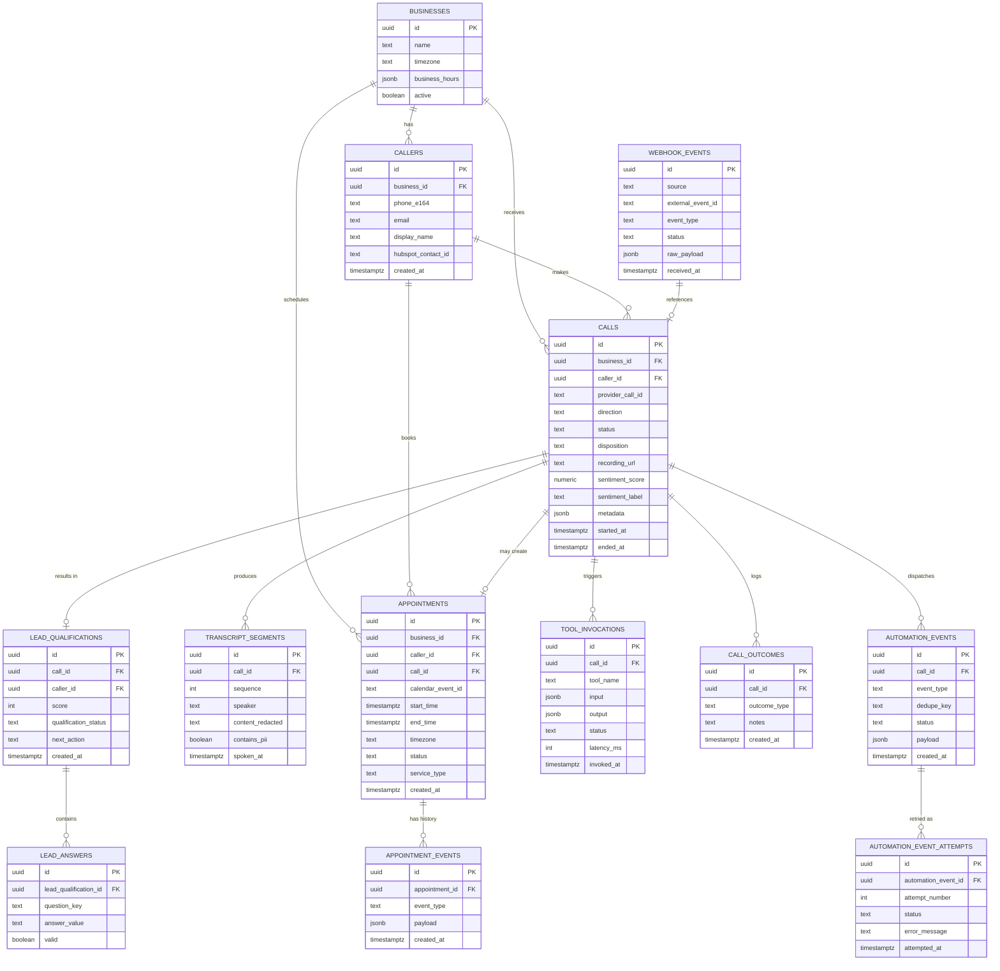

# Database Schema — AI Voice Agent (Appointment Booking & Lead Qualification)

**Engine:** PostgreSQL 15+ (Supabase-hosted)
**Sample business:** Single-tenant for MVP (dental clinic), schema is written so a `business_id` column can promote it to multi-tenant later without a rewrite.
**Migration tool:** `node-pg-migrate` (or Prisma Migrate if the backend adopts Prisma — DDL below is engine-level and works with either).

---

## 1. Entity-Relationship Diagram



---

## 2. DDL

```sql
-- Extensions
create extension if not exists "pgcrypto"; -- for gen_random_uuid()

-- ============================================================
-- BUSINESSES
-- ============================================================
create table businesses (
    id uuid primary key default gen_random_uuid(),
    name text not null,
    timezone text not null default 'America/New_York',
    business_hours jsonb not null default '{}'::jsonb, -- { "mon": ["09:00","17:00"], ... }
    active boolean not null default true,
    created_at timestamptz not null default now(),
    updated_at timestamptz not null default now()
);

-- ============================================================
-- CALLERS
-- ============================================================
create table callers (
    id uuid primary key default gen_random_uuid(),
    business_id uuid not null references businesses(id) on delete cascade,
    phone_e164 text not null,
    email text,
    display_name text,
    hubspot_contact_id text,
    created_at timestamptz not null default now(),
    updated_at timestamptz not null default now(),
    constraint callers_phone_format check (phone_e164 ~ '^\+[1-9][0-9]{6,14}$')
);

create unique index callers_business_phone_uidx on callers (business_id, phone_e164);
create index callers_hubspot_contact_idx on callers (hubspot_contact_id) where hubspot_contact_id is not null;

-- ============================================================
-- CALLS
-- ============================================================
create type call_direction as enum ('inbound', 'outbound');
create type call_status as enum ('in_progress', 'completed', 'failed', 'no_answer', 'voicemail');
create type call_disposition as enum (
    'booked', 'rescheduled', 'cancelled', 'qualified_lead', 'unqualified_lead',
    'human_handoff', 'no_action', 'error', 'abandoned'
);

create table calls (
    id uuid primary key default gen_random_uuid(),
    business_id uuid not null references businesses(id) on delete cascade,
    caller_id uuid references callers(id) on delete set null,
    provider_call_id text not null, -- Retell's call_id
    direction call_direction not null,
    status call_status not null default 'in_progress',
    disposition call_disposition,
    recording_url text,
    sentiment_score numeric(4,3), -- -1.000 to 1.000
    sentiment_label text check (sentiment_label in ('positive','neutral','negative')),
    metadata jsonb not null default '{}'::jsonb, -- from_number, to_number, agent_id, consent flags, etc.
    started_at timestamptz not null default now(),
    ended_at timestamptz,
    created_at timestamptz not null default now()
);

create unique index calls_provider_call_id_uidx on calls (provider_call_id);
create index calls_business_started_idx on calls (business_id, started_at desc);
create index calls_disposition_idx on calls (disposition);

-- ============================================================
-- TRANSCRIPT SEGMENTS
-- Stored per-utterance rather than one giant blob, to support
-- redaction, search, and partial-failure recovery.
-- ============================================================
create table transcript_segments (
    id uuid primary key default gen_random_uuid(),
    call_id uuid not null references calls(id) on delete cascade,
    sequence int not null,
    speaker text not null check (speaker in ('agent','caller')),
    content_redacted text not null, -- PII-scrubbed version stored by default
    content_raw_encrypted bytea,     -- optional, pgcrypto-encrypted raw text, restricted access
    contains_pii boolean not null default false,
    spoken_at timestamptz not null,
    created_at timestamptz not null default now()
);

create unique index transcript_segments_call_seq_uidx on transcript_segments (call_id, sequence);

-- ============================================================
-- TOOL INVOCATIONS (every tool call the agent made mid-conversation)
-- ============================================================
create table tool_invocations (
    id uuid primary key default gen_random_uuid(),
    call_id uuid not null references calls(id) on delete cascade,
    tool_name text not null,
    input jsonb not null,
    output jsonb,
    status text not null check (status in ('pending','success','failed','timeout')),
    latency_ms int,
    invoked_at timestamptz not null default now()
);

create index tool_invocations_call_idx on tool_invocations (call_id);
create index tool_invocations_tool_status_idx on tool_invocations (tool_name, status);

-- ============================================================
-- APPOINTMENTS
-- ============================================================
create type appointment_status as enum ('booked','rescheduled','cancelled','completed','no_show');

create table appointments (
    id uuid primary key default gen_random_uuid(),
    business_id uuid not null references businesses(id) on delete cascade,
    caller_id uuid not null references callers(id) on delete cascade,
    call_id uuid references calls(id) on delete set null,
    calendar_event_id text not null, -- Google Calendar event id
    start_time timestamptz not null,
    end_time timestamptz not null,
    timezone text not null,
    status appointment_status not null default 'booked',
    service_type text not null default 'general_checkup',
    created_at timestamptz not null default now(),
    updated_at timestamptz not null default now(),
    constraint appointments_time_order check (end_time > start_time)
);

-- Prevents double-booking the same calendar slot at the DB level
-- (defense in depth in addition to the pre-write availability re-check).
create unique index appointments_calendar_event_uidx on appointments (calendar_event_id);
create index appointments_business_time_idx on appointments (business_id, start_time);
create index appointments_caller_idx on appointments (caller_id);

-- Overlap-prevention index using btree_gist (optional but recommended)
create extension if not exists btree_gist;
alter table appointments add column time_range tstzrange
    generated always as (tstzrange(start_time, end_time, '[)')) stored;
create index appointments_time_range_gist on appointments using gist (business_id, time_range);
-- Application layer should still additionally enforce via exclusion constraint if
-- appointments must never overlap per resource/provider:
-- alter table appointments add constraint appointments_no_overlap
--   exclude using gist (business_id with =, time_range with &&) where (status = 'booked');

create table appointment_events (
    id uuid primary key default gen_random_uuid(),
    appointment_id uuid not null references appointments(id) on delete cascade,
    event_type text not null check (event_type in ('created','rescheduled','cancelled','reminder_sent','completed','no_show')),
    payload jsonb not null default '{}'::jsonb,
    created_at timestamptz not null default now()
);

-- ============================================================
-- LEAD QUALIFICATION
-- ============================================================
create type qualification_status as enum ('qualified','unqualified','needs_review','incomplete');

create table lead_qualifications (
    id uuid primary key default gen_random_uuid(),
    call_id uuid not null references calls(id) on delete cascade,
    caller_id uuid not null references callers(id) on delete cascade,
    score int not null default 0,
    qualification_status qualification_status not null default 'incomplete',
    next_action text not null check (next_action in ('book','transfer','callback','follow_up','none')),
    created_at timestamptz not null default now()
);

create table lead_answers (
    id uuid primary key default gen_random_uuid(),
    lead_qualification_id uuid not null references lead_qualifications(id) on delete cascade,
    question_key text not null, -- e.g. "insurance_provider", "urgency_level"
    answer_value text not null,
    valid boolean not null default true,
    created_at timestamptz not null default now()
);

create index lead_answers_lead_idx on lead_answers (lead_qualification_id);

-- ============================================================
-- CALL OUTCOMES (final structured log, one row typically per call)
-- ============================================================
create table call_outcomes (
    id uuid primary key default gen_random_uuid(),
    call_id uuid not null references calls(id) on delete cascade,
    outcome_type text not null,
    notes text,
    created_at timestamptz not null default now()
);

-- ============================================================
-- AUTOMATION EVENTS (outbound events sent to n8n) + retry log
-- ============================================================
create type automation_status as enum ('pending','sent','acknowledged','failed','dead_letter');

create table automation_events (
    id uuid primary key default gen_random_uuid(),
    call_id uuid not null references calls(id) on delete cascade,
    event_type text not null, -- 'call.completed', 'lead.qualified', 'appointment.booked', etc.
    dedupe_key text not null, -- e.g. `${call_id}:${event_type}`
    status automation_status not null default 'pending',
    payload jsonb not null,
    created_at timestamptz not null default now(),
    updated_at timestamptz not null default now()
);

create unique index automation_events_dedupe_uidx on automation_events (dedupe_key);
create index automation_events_status_idx on automation_events (status);

create table automation_event_attempts (
    id uuid primary key default gen_random_uuid(),
    automation_event_id uuid not null references automation_events(id) on delete cascade,
    attempt_number int not null,
    status text not null check (status in ('success','failed')),
    error_message text,
    attempted_at timestamptz not null default now()
);

create index automation_event_attempts_event_idx on automation_event_attempts (automation_event_id);

-- ============================================================
-- WEBHOOK EVENTS (inbound idempotency ledger for ALL inbound webhooks:
-- Retell call events, n8n callbacks, etc.)
-- ============================================================
create type webhook_status as enum ('received','processing','processed','ignored_duplicate','failed');

create table webhook_events (
    id uuid primary key default gen_random_uuid(),
    source text not null check (source in ('retell','n8n','google_calendar','hubspot','twilio','sendgrid')),
    external_event_id text not null, -- provider's event/call id, or a computed hash if none provided
    event_type text not null,
    status webhook_status not null default 'received',
    call_id uuid references calls(id) on delete set null,
    raw_payload jsonb not null,
    received_at timestamptz not null default now(),
    processed_at timestamptz
);

create unique index webhook_events_source_external_id_uidx on webhook_events (source, external_event_id);

-- ============================================================
-- ADMIN USERS (dashboard access — Phase 6)
-- ============================================================
create type admin_role as enum ('admin','staff','read_only');

create table admin_users (
    id uuid primary key default gen_random_uuid(),
    email text not null unique,
    password_hash text not null,
    role admin_role not null default 'staff',
    business_id uuid references businesses(id) on delete cascade,
    last_login_at timestamptz,
    created_at timestamptz not null default now()
);

-- ============================================================
-- AUDIT LOG (who/what/when for any mutation via the dashboard or API)
-- ============================================================
create table audit_log (
    id uuid primary key default gen_random_uuid(),
    actor_type text not null check (actor_type in ('admin_user','system','agent')),
    actor_id text, -- admin_users.id as text, or 'system', or provider_call_id
    action text not null, -- 'appointment.cancel', 'lead.status_override', etc.
    resource_type text not null,
    resource_id uuid,
    before_state jsonb,
    after_state jsonb,
    ip_address inet,
    created_at timestamptz not null default now()
);

create index audit_log_resource_idx on audit_log (resource_type, resource_id);
create index audit_log_created_idx on audit_log (created_at desc);
```

---

## 3. Idempotency & concurrency notes

- **Booking race conditions:** `bookAppointment` must (1) re-check availability against Google Calendar immediately before writing, inside the same request, and (2) rely on the `appointments_calendar_event_uidx` unique index as a hard backstop — a second concurrent insert for the same `calendar_event_id` will fail at the DB layer and must be caught and converted into a "slot just taken, offering alternatives" response.
- **Webhook idempotency:** Every inbound webhook (Retell call events, n8n failure callbacks) is first written to `webhook_events` keyed on `(source, external_event_id)`. If the unique constraint conflicts, the handler short-circuits and returns `200 OK` with `status: ignored_duplicate` — this is required because Retell retries webhook delivery up to 3 times on non-2xx responses.
- **Automation dedupe:** `automation_events.dedupe_key` (`${call_id}:${event_type}`) prevents the same call from ever triggering two HubSpot upserts or two SMS/email sends, even if the backend crashes and reprocesses a call.

## 4. Data retention & redaction

- `transcript_segments.content_redacted` is the default-readable column; a lightweight PII scrubber (regex + NER pass) runs before insert to mask phone numbers, emails, and addresses embedded in speech. Raw content is only kept in `content_raw_encrypted` (pgcrypto `pgp_sym_encrypt`) if legally required, and access to decrypt is restricted to a single `compliance_admin` Postgres role.
- Recommended retention: transcripts and call recordings purged after 90 days by default for the demo (configurable per business), with a scheduled job (`pg_cron` or an n8n cron workflow) that nulls out `recording_url` and `content_raw_encrypted` past the retention window while keeping aggregate/structured data (`call_outcomes`, `lead_qualifications`) for analytics.
- `audit_log` is retained indefinitely (or per your compliance policy) since it's small and high-value for incident review.

## 5. Security notes specific to this schema

- Enable **Row-Level Security (RLS)** on all tenant-scoped tables (`callers`, `calls`, `appointments`, etc.) keyed on `business_id`, even in single-tenant MVP — it's a one-time cost now and prevents a whole class of bugs if you ever add a second business.
- Application backend connects with a role that has **no `DROP`/`ALTER` privileges** in production; migrations run under a separate elevated role via CI, never the runtime app role.
- `admin_users.password_hash` uses bcrypt/argon2 — never store plaintext, and never log it (add to your structured logger's redaction list).
- All `jsonb` columns that may contain caller PII (`calls.metadata`, `tool_invocations.input/output`) should go through the same redaction pass before being written to logs (not just to the DB) — logs are a common PII leak vector that a schema alone doesn't fix.
