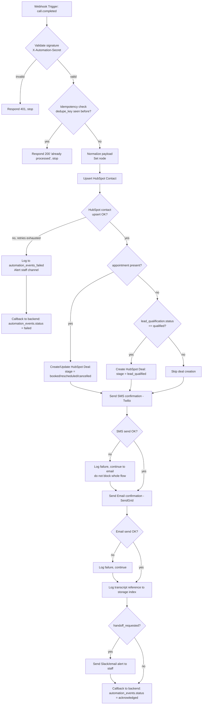
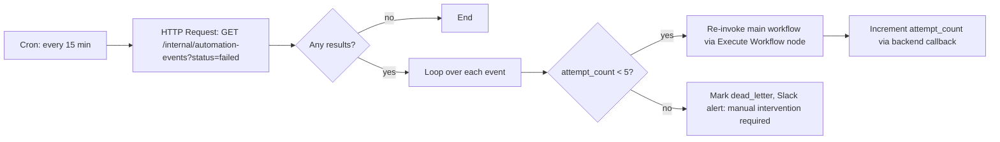

# n8n Event Map — Post-Call Automation

This document defines the event contract between the backend and n8n, the node-by-node workflow design, and the retry/error-handling strategy for post-call automation (CRM, SMS, email, staff alerts, transcript logging).

**Boundary principle:** the live call path (backend ↔ Retell) never talks to n8n synchronously. All n8n involvement is **post-call, asynchronous**, triggered by `automation_events` rows the backend writes after a call ends. This keeps CRM/SMS/email latency and outages completely isolated from live conversation latency.

---

## 1. Trigger contract (backend → n8n)

The backend calls a single n8n **Webhook** node trigger URL (`N8N_WEBHOOK_URL`) once per `automation_events` row, immediately after writing it with `status='pending'`.

### Outbound payload (backend → n8n)

```json
{
  "event_id": "ae_9f3c...",
  "event_type": "call.completed",
  "dedupe_key": "call_abc123:call.completed",
  "call": {
    "call_id": "call_abc123",
    "business_id": "biz_001",
    "direction": "inbound",
    "disposition": "booked",
    "sentiment_label": "positive",
    "started_at": "2026-07-30T18:02:00Z",
    "ended_at": "2026-07-30T18:06:45Z"
  },
  "contact": {
    "contact_id": "clr_1122",
    "name": "Jordan Lee",
    "phone_e164": "+15551234567",
    "email": "jordan@example.com",
    "hubspot_contact_id": null
  },
  "appointment": {
    "appointment_id": "8f3e2b10-...",
    "start_time": "2026-07-31T14:00:00-04:00",
    "end_time": "2026-07-31T14:30:00-04:00",
    "service_type": "cleaning",
    "status": "booked"
  },
  "lead_qualification": {
    "qualification_status": "qualified",
    "score": 7,
    "next_action": "book"
  },
  "handoff_requested": false,
  "transcript_url": "https://internal.example.com/api/calls/call_abc123/transcript",
  "meta": {
    "source": "backend",
    "schema_version": "1"
  }
}
```

Headers:
```
Content-Type: application/json
X-Automation-Secret: <N8N_WEBHOOK_SECRET shared secret>
```

`appointment` and `lead_qualification` objects are `null` when not applicable to the call (e.g., an abandoned call with no booking and no qualification captured).

> **Note:** The person object is named **`contact`** (not `caller`). n8n’s expression sandbox blocks the property name `caller`.

---

## 2. Event types

| `event_type` | Fired when | Primary n8n actions |
|---|---|---|
| `call.completed` | Every call, regardless of outcome | Normalize, route by disposition, always log transcript reference |
| `appointment.booked` | A booking succeeded | HubSpot deal update, SMS + email confirmation |
| `appointment.rescheduled` | Reschedule succeeded | HubSpot deal note, SMS + email update |
| `appointment.cancelled` | Cancellation succeeded | HubSpot deal update, SMS/email cancellation notice |
| `lead.qualified` | Lead scored qualified but not booked | HubSpot contact/deal creation, follow-up task |
| `handoff.requested` | Caller asked for or triggered human handoff | Immediate staff alert (Slack/email), HubSpot note |
| `automation.failed` | Any node in a downstream workflow exhausts retries | Dead-letter logging, staff alert, backend callback |

In practice, the backend emits **one `call.completed` event per call** carrying all the context above; the n8n workflow internally branches into the other logical actions based on the payload fields (`appointment`, `lead_qualification`, `handoff_requested`) rather than the backend firing multiple separate webhook calls. This keeps the dedupe/idempotency story to a single event per call.

---

## 3. Workflow diagram



---

## 4. Node-by-node build instructions

### Node 1 — Webhook (Trigger)
- **Type:** Webhook
- **HTTP Method:** POST
- **Path:** `/webhook/call-completed`
- **Authentication:** None at the n8n-node level (n8n's built-in webhook auth is skipped so we can control the signature check explicitly in Node 2, keeping the check-and-log logic visible/testable in the workflow itself).
- **Response mode:** "Using 'Respond to Webhook' node" (so we control the exact response after processing, not immediately).

### Node 2 — IF: Validate Signature
- Compare incoming header `X-Automation-Secret` to the n8n environment variable `{{$env.N8N_WEBHOOK_SECRET}}`.
- Expression: `{{$json.headers['x-automation-secret'] === $env.N8N_WEBHOOK_SECRET}}`
- **False branch →** Respond to Webhook node, HTTP 401, body `{ "error": "invalid_signature" }`, then stop.

### Node 3 — Postgres/HTTP Request: Idempotency Check
- Query (or call an internal backend endpoint) checking whether `dedupe_key` has already been marked `acknowledged` in `automation_events`.
- **If already processed →** Respond to Webhook, HTTP 200, `{ "status": "already_processed" }`, stop. This handles n8n or backend retries safely.

### Node 4 — Set: Normalize Payload
- Flatten nested fields into workflow variables used downstream:
  - `caller_name`, `caller_phone`, `caller_email`
  - `appointment_start_local` (formatted for human-readable SMS/email)
  - `disposition`, `qualification_status`, `handoff_requested`

### Node 5 — HubSpot: Upsert Contact
- **Operation:** Create or Update Contact
- **Match on:** `email` if present, else `phone`
- **Fields mapped:** `firstname`/`lastname` (split from `caller_name`), `phone`, `email`, custom property `last_call_disposition`.
- **On error:** n8n's built-in "Continue On Fail" is **off** here — failure routes to the error branch (Node 5b) so we don't silently skip CRM sync.
- **Retry:** n8n node-level retry, 3 attempts, exponential backoff (2s, 8s, 20s).

### Node 5b — Error branch: HubSpot failure
- HTTP Request node → backend `/internal/automation-failure` with `{ event_id, node: "hubspot_upsert_contact", error }`.
- Slack node → `#voice-agent-alerts` channel: "⚠️ HubSpot sync failed for call {{call_id}} — see automation_events for retry."
- Respond to Webhook: HTTP 200 (we acknowledge receipt to the backend even on downstream failure — the backend's job is done; **our** job is tracking and alerting on the failure, not making the backend retry the whole event).

### Node 6 — Switch: Route by outcome
- Branch 1: `appointment != null` → Node 7 (Deal: booked/rescheduled/cancelled)
- Branch 2: `lead_qualification.qualification_status == "qualified"` and no appointment → Node 7b (Deal: lead_qualified)
- Branch 3 (default): skip deal creation, continue to confirmations

### Node 7 / 7b — HubSpot: Create or Update Deal
- **Deal stage mapping:**
  - `appointment.status == "booked"` → `appointment_scheduled`
  - `appointment.status == "rescheduled"` → `appointment_scheduled` (with a note logged)
  - `appointment.status == "cancelled"` → `closed_lost` (with reason)
  - `lead_qualification.qualification_status == "qualified"` (no appointment) → `qualified_lead`
- **Associated contact:** the contact ID returned from Node 5.

### Node 8 — Twilio: Send SMS
- **To:** `caller_phone`
- **From:** `TWILIO_SMS_FROM_NUMBER`
- **Body template (booking example):**
  ```
  Hi {{caller_name}}, this confirms your {{service_type}} appointment on {{appointment_start_local}}.
  Reply STOP to opt out of texts.
  ```
- **On error:** Continue On Fail = **true** here — an SMS failure should not block the email confirmation. Failure is still logged via Node 8b (HTTP Request to backend + append to an in-memory error list carried forward via a Set node) for the final failure summary.

### Node 9 — SendGrid: Send Email
- Similar structure to Node 8; Continue On Fail = true.
- Template varies by `disposition` (booking confirmation vs. cancellation vs. qualified-lead follow-up email) — implemented as 3 separate SendGrid dynamic templates selected via the Switch node's branch.

### Node 10 — HTTP Request: Log Transcript Reference
- Calls backend `/internal/transcripts/index` with `{ call_id, transcript_url }` so the review dashboard can link directly — the transcript itself already lives in Postgres; this step is about search-index/reference bookkeeping, not re-storing the transcript.

### Node 11 — IF: Handoff Requested
- **True →** Slack node to `#staff-handoff` + SendGrid "urgent" email to on-call staff distribution list.
- **False →** skip.

### Node 12 — Respond to Webhook (success path)
- HTTP 200, body: `{ "status": "processed", "event_id": "...", "warnings": [ /* any partial failures collected along the way */ ] }`
- Also fires a final HTTP Request back to the backend to flip `automation_events.status` to `acknowledged` (or `failed` if the HubSpot branch hit the error path).

---

## 5. Idempotency & retries — policy summary

| Layer | Mechanism |
|---|---|
| Backend → n8n delivery | Backend retries the webhook POST itself up to 3 times (backoff 2s/8s/20s) if n8n doesn't return 2xx within 10s; each attempt logged to `automation_event_attempts` |
| n8n entry | Dedupe check (Node 3) against `dedupe_key` before doing any work — safe against backend retries and any manual re-triggers |
| HubSpot node | n8n node-level retry (3x, exponential backoff); hard failure routes to alert + backend callback, never silently dropped |
| SMS / Email nodes | Continue On Fail = true, individually logged; one channel failing never blocks the other or the rest of the workflow |
| Dead letters | Any event that fails HubSpot sync after retries is marked `automation_events.status = 'failed'`; a scheduled n8n workflow (cron, every 15 min) queries the backend for `status='failed'` events and re-attempts up to a max of 5 total attempts before requiring manual intervention |

---

## 6. Security

- Shared secret header (`X-Automation-Secret`) validated on every inbound webhook — rejected requests never proceed past Node 2.
- n8n instance itself sits behind its own auth (basic auth or SSO) for the editor UI; the webhook endpoint is the only publicly reachable path, and only accepts POST.
- No raw transcript text is passed through the n8n payload — only a reference URL requiring the backend's own internal auth to fetch, so n8n workflow execution logs (which n8n retains) never contain caller PII beyond name/phone/email already needed for CRM/SMS/email.
- HubSpot, Twilio, and SendGrid credentials are stored as n8n **Credentials** (encrypted at rest by n8n), never hardcoded in node parameters.
- Rate limiting: the backend throttles outbound events to n8n at a sane ceiling (e.g., 60/minute) to protect against a runaway loop from a backend bug flooding n8n and downstream CRM/SMS APIs.

---

## 7. Failure-workflow (dead-letter) diagram


