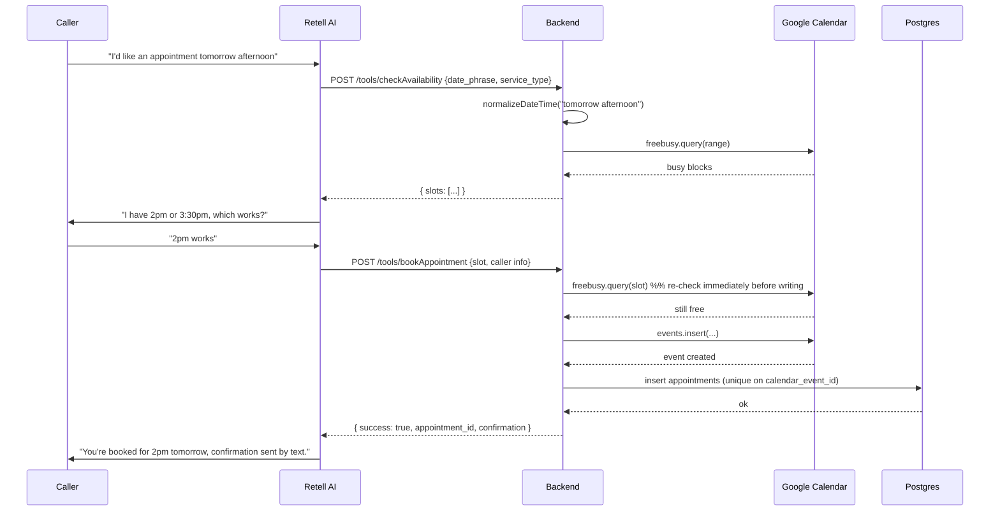
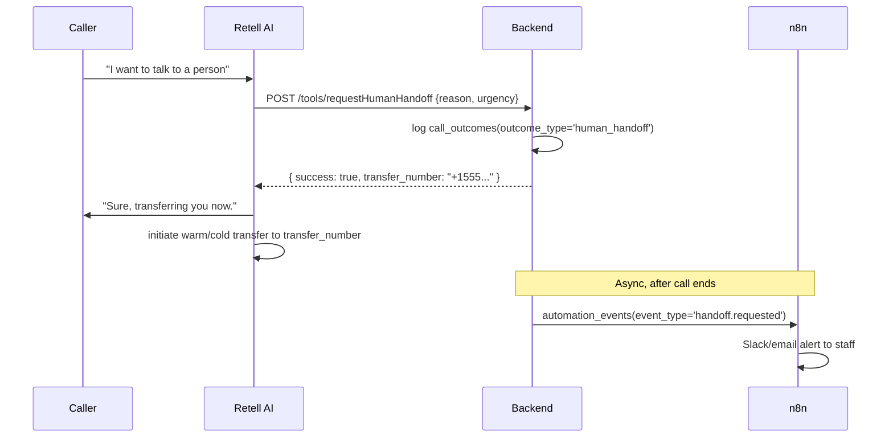

# Voice Agent Tool Contracts — Retell AI Custom Functions

This document defines every tool (custom function) the voice agent can invoke mid-call, plus the transport contract between Retell AI and our backend.

---

## 1. Transport contract (Retell → backend)

Each tool is registered in the Retell agent config as a **Custom Function** with a `url` pointing at our backend, method `POST`, JSON body. Retell-specific behavior our implementation must account for:

- **Timeout:** configurable per function; defaults to 2 minutes if unspecified. We explicitly set **8 seconds** on every tool (well under Retell's default) so a hung dependency doesn't stall the live call — our own internal timeout budget per external API call (Google Calendar, HubSpot, etc.) is 3–4 seconds, leaving headroom for retries.
- **Retry on failure:** Retell retries a failed function call (non-2xx or timeout) **up to 2 times**. All tool handlers must therefore be **idempotent** — a retried `bookAppointment` call must not create a second appointment.
- **Response size cap:** the function result returned to the LLM is capped at **15,000 characters** — our responses are compact structured JSON, never raw transcripts or large payloads.
- **Success status:** any 2xx. We always return `200` with a structured body, even for "business logic failure" cases (e.g., "no slots available") — HTTP-layer errors are reserved for actual infrastructure failures, so Retell's retry-on-non-2xx doesn't get triggered by ordinary, expected outcomes.
- **Auth:** every tool endpoint requires a shared-secret header (`X-Internal-Tool-Secret`) matching `RETELL_TOOL_SECRET`, checked before any business logic runs. This is separate from the `x-retell-signature` used on the async call-lifecycle webhooks.
- **Call context:** Retell includes call metadata (`call_id` at minimum) alongside the function's arguments in the POST body. We use `call_id` (Retell's `provider_call_id`) to correlate every tool invocation back to our `calls` table row, and log every invocation to `tool_invocations` before returning a response (see `database-schema.md`).

### Generic request/response envelope

```jsonc
// Request (Retell -> backend)
{
  "call": {
    "call_id": "call_abc123",
    "agent_id": "agent_xyz789"
  },
  "name": "checkAvailability",
  "args": { /* tool-specific input, see below */ }
}
```

```jsonc
// Response (backend -> Retell), always HTTP 200
{
  "result": { /* tool-specific output, see below */ }
}
```

If a tool's internal logic fails for a business reason (e.g., calendar unreachable), we still return `200` with a `result.success: false` and an `error` object — this becomes part of the conversation context, and the agent's system prompt instructs it to gracefully tell the caller we're having trouble and offer a human handoff or callback, never to invent data.

---

## 2. Sequence diagrams

### 2.1 Booking flow



### 2.2 Human handoff flow



---

## 3. Tool definitions

Each tool below is specified as: purpose, JSON Schema input (as registered with Retell), Zod validation on the backend, example request/response, failure response, and retry/timeout behavior.

### 3.1 `checkAvailability`

**Purpose:** Return open appointment slots for a service type within a caller-specified date range, resolving relative phrases ("tomorrow afternoon") to concrete ISO datetimes in the business's timezone.

**Input JSON Schema (Retell function parameters):**
```json
{
  "type": "object",
  "properties": {
    "date_phrase": { "type": "string", "description": "Caller's spoken date/time preference, e.g. 'tomorrow afternoon' or 'next Tuesday morning'" },
    "service_type": { "type": "string", "enum": ["general_checkup", "cleaning", "consultation", "emergency"] },
    "duration_minutes": { "type": "integer", "default": 30 }
  },
  "required": ["date_phrase", "service_type"]
}
```

**Zod validation (backend):**
```typescript
const CheckAvailabilityInput = z.object({
  date_phrase: z.string().min(1).max(200),
  service_type: z.enum(["general_checkup", "cleaning", "consultation", "emergency"]),
  duration_minutes: z.number().int().min(15).max(180).default(30),
});
```

**Validation rules:**
- `date_phrase` normalized via a deterministic NLP-date-parsing step (e.g. `chrono-node`) constrained to the business's timezone; results outside business hours or more than 60 days out are rejected with a clarification prompt rather than silently clamped.
- `service_type` must match a configured service; unknown values fall back to `general_checkup` with a flag for review rather than failing the call.

**Example request:**
```json
{ "call": { "call_id": "call_abc123" }, "name": "checkAvailability",
  "args": { "date_phrase": "tomorrow afternoon", "service_type": "cleaning", "duration_minutes": 30 } }
```

**Example success response:**
```json
{ "result": {
  "success": true,
  "resolved_range": { "start": "2026-07-31T12:00:00-04:00", "end": "2026-07-31T17:00:00-04:00" },
  "slots": [
    { "start": "2026-07-31T14:00:00-04:00", "end": "2026-07-31T14:30:00-04:00" },
    { "start": "2026-07-31T15:30:00-04:00", "end": "2026-07-31T16:00:00-04:00" }
  ]
}}
```

**Failure response (no slots):**
```json
{ "result": {
  "success": true,
  "resolved_range": { "start": "2026-07-31T12:00:00-04:00", "end": "2026-07-31T17:00:00-04:00" },
  "slots": [],
  "message": "No availability in that window. Suggest offering the next business day."
}}
```

**Hard failure (calendar API down):**
```json
{ "result": {
  "success": false,
  "error": { "code": "CALENDAR_UNAVAILABLE", "message": "Could not reach calendar service" }
}}
```

**Retry/timeout:** internal 4s timeout on the Google Calendar call; on timeout, return the hard-failure shape above (still HTTP 200) so the agent can apologize and offer a callback rather than the call hanging. No backend-side retry to Google within the same tool call — a single fast attempt to protect latency; the *next* caller turn naturally re-triggers a fresh `checkAvailability` if needed.

---

### 3.2 `bookAppointment`

**Purpose:** Create a calendar event and appointment record for a specific, previously-offered slot.

**Input schema:**
```json
{
  "type": "object",
  "properties": {
    "slot_start": { "type": "string", "description": "ISO 8601 datetime of the chosen slot" },
    "service_type": { "type": "string" },
    "caller_name": { "type": "string" },
    "caller_phone": { "type": "string", "description": "E.164 format" },
    "caller_email": { "type": "string" }
  },
  "required": ["slot_start", "service_type", "caller_name", "caller_phone"]
}
```

**Zod validation:**
```typescript
const BookAppointmentInput = z.object({
  slot_start: z.string().datetime(),
  service_type: z.enum(["general_checkup", "cleaning", "consultation", "emergency"]),
  caller_name: z.string().min(1).max(120),
  caller_phone: z.string().regex(/^\+[1-9]\d{6,14}$/, "Must be E.164"),
  caller_email: z.string().email().optional(),
});
```

**Validation rules:**
- `slot_start` must fall on a valid appointment-length boundary and within business hours — reject with `INVALID_SLOT` rather than silently rounding.
- `caller_phone` normalized to E.164 before validation; if the caller only gave a partial number verbally, the agent must have already re-confirmed it letter-by-letter earlier in the conversation (enforced in the system prompt, not this tool).
- Idempotency key: `${call_id}:bookAppointment` — if a `tool_invocations` row already exists for this call with `tool_name='bookAppointment'` and `status='success'`, return the **same** stored result instead of creating a second event (handles Retell's up-to-2 retries).

**Example request:**
```json
{ "call": { "call_id": "call_abc123" }, "name": "bookAppointment",
  "args": { "slot_start": "2026-07-31T14:00:00-04:00", "service_type": "cleaning",
            "caller_name": "Jordan Lee", "caller_phone": "+15551234567", "caller_email": "jordan@example.com" } }
```

**Example success response:**
```json
{ "result": {
  "success": true,
  "appointment_id": "8f3e2b10-...",
  "calendar_event_id": "gcal_evt_9182",
  "confirmed_start": "2026-07-31T14:00:00-04:00",
  "confirmed_end": "2026-07-31T14:30:00-04:00"
}}
```

**Failure response (slot taken between check and book):**
```json
{ "result": {
  "success": false,
  "error": { "code": "SLOT_NO_LONGER_AVAILABLE", "message": "Slot was booked by another caller" },
  "alternative_slots": [ { "start": "2026-07-31T15:30:00-04:00", "end": "2026-07-31T16:00:00-04:00" } ]
}}
```

**Retry/timeout:** re-check availability against Google Calendar synchronously before writing (see sequence diagram); DB unique constraint on `calendar_event_id` is the final backstop. Internal timeout 5s; on ambiguous failure (e.g., Calendar wrote the event but our DB insert failed), a reconciliation job compares Calendar events to `appointments` rows every 15 minutes and flags orphans for manual review rather than silently retrying a write of unknown state.

---

### 3.3 `rescheduleAppointment`

**Input schema:**
```json
{
  "type": "object",
  "properties": {
    "caller_phone": { "type": "string", "description": "E.164 phone used to find the latest active appointment" },
    "appointment_id": { "type": "string", "description": "Optional UUID override" },
    "new_slot_start": { "type": "string" }
  },
  "required": ["new_slot_start"]
}
```
**Zod:** `caller_phone` (E.164) **or** `appointment_id` (uuid); `new_slot_start` required.

**Validation rules:** resolve latest `booked`/`rescheduled` appointment by `caller_phone` (preferred) or by `appointment_id`. Re-checks new slot availability the same way as `bookAppointment`.

**Success:** `{ "success": true, "appointment_id", "old_start", "new_start" }`
**Failure:** `NOT_FOUND`, `SLOT_NO_LONGER_AVAILABLE`, `ALREADY_CANCELLED`.
**Idempotency:** dedupe on successful `rescheduleAppointment` for the call; writes an `appointment_events` row (`event_type='rescheduled'`).

---

### 3.4 `cancelAppointment`

**Input schema:** `{ "caller_phone": "string (E.164 preferred)", "appointment_id": "string (optional)", "reason": "string (optional)" }`
**Validation:** resolve appointment by phone (latest active) or id; no-op (idempotent success) if already cancelled.
**Success:** `{ "success": true, "appointment_id", "status": "cancelled" }`
**Failure:** `NOT_FOUND`.
**Side effect:** deletes/cancels the Google Calendar event, logs `appointment_events(event_type='cancelled')`.

---

### 3.5 `createOrUpdateContact`

**Purpose:** Upsert the caller into our own `callers` table mid-call (not HubSpot directly — HubSpot sync happens post-call via n8n to keep the live call path fast and decoupled from CRM latency/outages).

**Input schema:** `{ "name": "string", "phone": "string", "email": "string (optional)" }`
**Zod:** phone required E.164, email optional but validated if present.
**Validation rule:** upsert keyed on `(business_id, phone_e164)` per the DB unique index — never creates duplicate caller rows for the same number.
**Success:** `{ "success": true, "caller_id" }`
**Failure:** `INVALID_PHONE_FORMAT`, `DB_UNAVAILABLE` (returns success:false, agent proceeds with call using in-memory data and flags for post-call reconciliation rather than derailing the conversation).

---

### 3.6 `saveLeadQualification`

**Input schema:**
```json
{
  "type": "object",
  "properties": {
    "answers": {
      "type": "array",
      "items": {
        "type": "object",
        "properties": {
          "question_key": { "type": "string" },
          "answer_value": { "type": "string" }
        },
        "required": ["question_key", "answer_value"]
      }
    }
  },
  "required": ["answers"]
}
```
**Validation rules:** each `question_key` must be one of the configured qualification questions for the business (rejects unknown keys rather than silently storing garbage); scoring logic runs server-side (never trust an LLM-computed score) using a simple configurable rubric (e.g., urgency=high +3, has_insurance=yes +2, budget_confirmed=yes +2; threshold ≥5 → `qualified`).
**Success:** `{ "success": true, "qualification_status": "qualified", "score": 7, "next_action": "book" }`
**Failure:** `INVALID_QUESTION_KEY`, `INCOMPLETE_ANSWERS` (partial credit stored with `qualification_status='incomplete'` rather than discarded).

---

### 3.7 `requestHumanHandoff`

**Input schema:** `{ "reason": "string", "urgency": "enum[low,medium,high,emergency]" }`
**Validation rule:** `urgency='emergency'` (e.g., a caller describing a medical emergency) triggers an **immediate** synchronous alert path (not just post-call n8n) — the tool response includes a flag the agent uses to prioritize an immediate warm transfer, and the backend fires a same-second internal alert in addition to the normal async automation event.
**Success:** `{ "success": true, "transfer_number": "+15550001111", "immediate_alert_sent": true }`
**Failure:** `NO_STAFF_AVAILABLE` → agent instructed (via system prompt) to take a callback number and promise a return call within a defined SLA rather than leaving the caller stranded.

---

### 3.8 `sendConfirmation`

**Purpose:** Explicitly requestable mid-call (e.g., caller asks "can you also text me that?") in addition to the automatic post-call confirmation via n8n — this tool triggers an *immediate* SMS/email rather than waiting for call-end automation.
**Input schema:** `{ "channel": "enum[sms,email,both]", "appointment_id": "string" }`
**Idempotency:** dedupe key `${call_id}:sendConfirmation:${channel}` prevents double-sends if retried.
**Success:** `{ "success": true, "sent_channels": ["sms"] }`
**Failure:** `TWILIO_UNAVAILABLE` / `SENDGRID_UNAVAILABLE` → success:false, agent tells caller confirmation will follow shortly (the async n8n post-call flow acts as a guaranteed-delivery fallback).

---

### 3.9 `logCallOutcome`

**Purpose:** Final structured outcome tag, called by the agent right before ending the call (belt-and-suspenders alongside the `call_ended` webhook's own disposition inference).
**Input schema:** `{ "outcome_type": "enum[booked,rescheduled,cancelled,qualified_lead,unqualified_lead,human_handoff,no_action,abandoned]", "notes": "string (optional)" }`
**Success:** `{ "success": true }` — always succeeds (writes best-effort; never blocks call termination).

---

## 4. Cross-cutting error taxonomy

| Error code | Meaning | Agent behavior |
|---|---|---|
| `INVALID_INPUT` | Zod validation failed | Ask caller to repeat/clarify the specific field |
| `SLOT_NO_LONGER_AVAILABLE` | Race condition on booking | Offer `alternative_slots` |
| `CALENDAR_UNAVAILABLE` / `HUBSPOT_UNAVAILABLE` / `TWILIO_UNAVAILABLE` / `SENDGRID_UNAVAILABLE` | Downstream API down | Apologize, proceed with degraded flow, flag for reconciliation |
| `NOT_FOUND` | Referenced appointment/caller doesn't exist | Clarify identity, don't guess |
| `NOT_OWNED_BY_CALLER` | Caller trying to modify someone else's appointment | Refuse, offer human handoff (possible security-relevant event → audit_log) |
| `DB_UNAVAILABLE` | Postgres unreachable | Degrade gracefully, never crash the call |

## 5. Security

- All tool endpoints require `X-Internal-Tool-Secret`, validated before touching any handler logic, plus HTTPS-only.
- Every tool invocation (input + output, PII-redacted) is logged to `tool_invocations` for audit and debugging — see `database-schema.md`.
- `NOT_OWNED_BY_CALLER` events are written to `audit_log` since they can indicate a social-engineering attempt against another caller's appointment.
- Rate limiting: max 20 tool calls per `call_id` — protects against a runaway conversation loop hammering downstream APIs.
